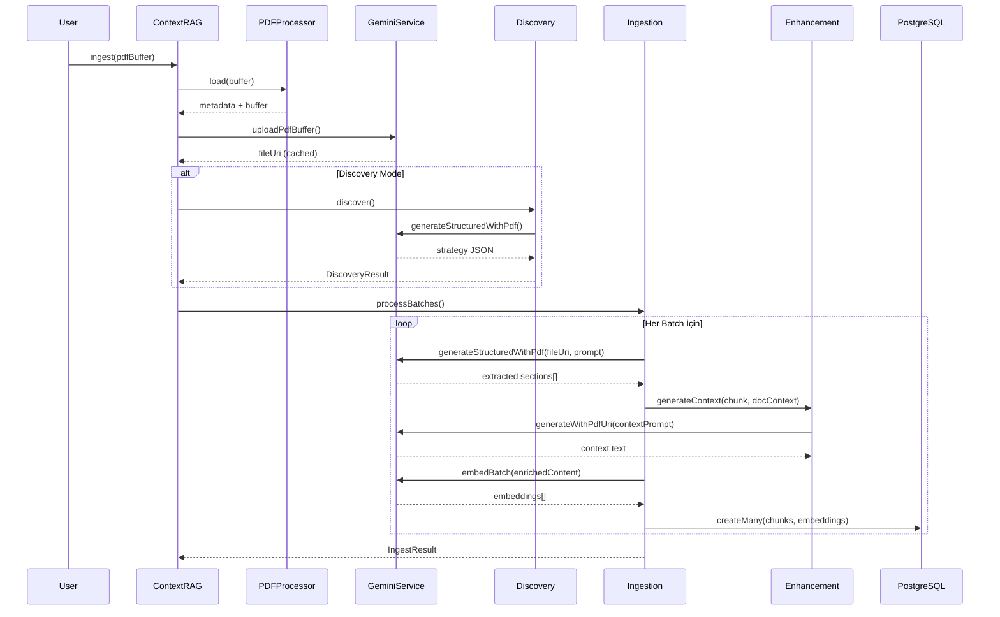
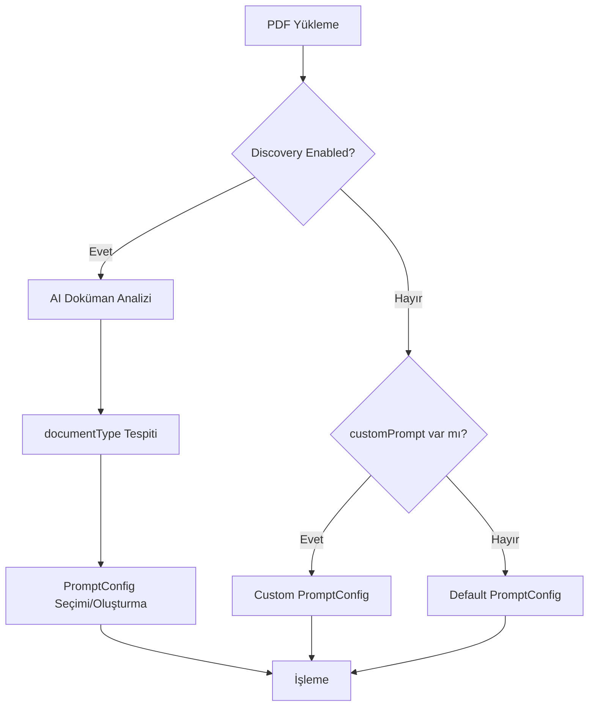

# ContextRAG PDF İşleme Sistemi Kapsamlı Analizi

> **Hazırlanma Tarihi:** 20 Ocak 2026  
> **Proje:** ContextRAG - Gemini Tabanlı RAG Sistemi

---

## 1. Giriş ve Genel Bakış

ContextRAG, Google Gemini AI modellerini kullanan gelişmiş bir **Retrieval-Augmented Generation (RAG)** sistemidir. Bu sistemin PDF işleme mimarisi, klasik metin çıkarma yaklaşımlarından radikal biçimde ayrılarak **multimodal AI anlayışını** merkeze alır.

```mermaid
graph TB
    subgraph "Klasik PDF İşleme"
        A[PDF Dosyası] --> B[Metin Çıkarma<br/>pdf-parse/pdfjs]
        B --> C[Mekanik Chunking<br/>Karakter/Token Sayısı]
        C --> D[Embedding<br/>OpenAI/Sentence-BERT]
        D --> E[Vector DB]
    end

    subgraph "ContextRAG PDF İşleme"
        F[PDF Dosyası] --> G[Gemini Files API<br/>Tam Doküman Cache]
        G --> H[AI Discovery<br/>Doküman Analizi]
        H --> I[Multimodal Extraction<br/>Görsel + Metin]
        I --> J[Semantic Chunking<br/>AI-Guided]
        J --> K[Context Enrichment<br/>Anthropic-Style]
        K --> L[Hybrid Indexing<br/>Vector + BM25]
    end
```



---

## 2. Sistem Mimarisi

### 2.1 Core Bileşenler

| Bileşen | Dosya | Sorumluluk |
|---------|-------|------------|
| **PDFProcessor** | [pdf.processor.ts](file:///c:/Users/Muhammed%20Sefa/Desktop/ContextRAG/src/services/pdf.processor.ts) | PDF yükleme, metadata çıkarma, batch oluşturma |
| **DiscoveryEngine** | [discovery.engine.ts](file:///c:/Users/Muhammed%20Sefa/Desktop/ContextRAG/src/engines/discovery.engine.ts) | AI-driven doküman analizi ve strateji önerisi |
| **IngestionEngine** | [ingestion.engine.ts](file:///c:/Users/Muhammed%20Sefa/Desktop/ContextRAG/src/engines/ingestion.engine.ts) | Asıl işleme orchestration, chunk oluşturma |
| **GeminiService** | [gemini.service.ts](file:///c:/Users/Muhammed%20Sefa/Desktop/ContextRAG/src/services/gemini.service.ts) | Gemini API entegrasyonu (Files, Vision, Embedding) |
| **RetrievalEngine** | [retrieval.engine.ts](file:///c:/Users/Muhammed%20Sefa/Desktop/ContextRAG/src/engines/retrieval.engine.ts) | Hybrid search (semantic + keyword) |
| **AnthropicHandler** | [anthropic.handler.ts](file:///c:/Users/Muhammed%20Sefa/Desktop/ContextRAG/src/enhancements/anthropic/anthropic.handler.ts) | Contextual Retrieval context üretimi |

### 2.2 Veri Akışı



---

## 3. Klasik PDF İşlemeden Farklar

### 3.1 Karşılaştırma Tablosu

| Özellik | Klasik Sistemler | ContextRAG |
|---------|------------------|------------|
| **Metin Çıkarma** | OCR + Regex tabanlı | AI multimodal anlayış |
| **Tablo İşleme** | Heuristic pattern matching | Görsel AI tanıma |
| **Chunking** | Karakter/token sayma | Semantic AI chunking |
| **Metadata** | Sadece PDF header | AI-inferred context |
| **Görsel İçerik** | Genellikle atlanır | Tam entegrasyon |
| **Context** | Yok veya manuel | Otomatik AI üretimi |
| **Adaptasyon** | Sabit kurallar | Doküman tipine göre dinamik |

### 3.2 Temel Farklılıklar

#### 3.2.1 Multimodal İşleme
```typescript
// Klasik: Sadece metin
const pdfData = await pdf(buffer);
const text = pdfData.text; // Tüm görsel bilgi kaybolur

// ContextRAG: PDF'i olduğu gibi AI'a gönderir
const fileUri = await this.gemini.uploadPdfBuffer(buffer, filename);
const result = await this.gemini.generateStructuredWithPdf(
    fileUri,
    prompt,
    SectionArraySchema
);
// Tablolar, grafikler, diyagramlar AI tarafından anlaşılır
```

#### 3.2.2 Akıllı Discovery
Klasik sistemler tüm PDF'leri aynı şekilde işler. ContextRAG önce dokümanı analiz eder:

```json
{
  "documentType": "Medical",
  "detectedElements": [
    { "type": "table", "count": 15, "description": "Vital signs tables" },
    { "type": "list", "count": 8, "description": "Medication lists" }
  ],
  "specialInstructions": [
    "Preserve medical terminology exactly",
    "Keep dosage formats: 500mg/day"
  ],
  "chunkStrategy": {
    "splitBy": "semantic",
    "preserveTables": true
  }
}
```

#### 3.2.3 Contextual Enrichment (Anthropic-Style)

ContextRAG, Anthropic'in **Contextual Retrieval** tekniğini uygular:

```typescript
// Her chunk için context üretilir
const context = await this.enhancementHandler.generateContext(chunkData, docContext);

// Context + Chunk birleştirilerek index'lenir
chunk.enrichedContent = `${context} ${chunk.searchContent}`;
chunk.searchContent = enriched; // BM25 index için
```

**Örnek:**
- **Ham Chunk:** "Metabolizma, organizmanın kimyasal reaksiyonlarıdır..."
- **Context:** `[Section: Biyokimya Temelleri] [Subsection: Enerji Metabolizması] [Keywords: ATP, glikoliz, sitokrom]`
- **Enriched:** `[Section: Biyokimya Temelleri] [...] Metabolizma, organizmanın kimyasal reaksiyonlarıdır...`

---

## 4. Birden Fazla PDF Türünün İşlenmesi

### 4.1 Dinamik Strateji Sistemi

ContextRAG, farklı PDF türlerini tek bir sistematik altında şu mekanizmayla işler:



### 4.2 PromptConfig Yapısı

Her doküman tipi için özelleştirilmiş konfigürasyon:

```typescript
// prisma/schema.prisma - ContextRagPromptConfig
model ContextRagPromptConfig {
  documentType String    // "Medical" | "Legal" | "Technical"
  systemPrompt String    // Tip-spesifik AI talimatları
  chunkStrategy Json     // { maxTokens, splitBy, preserveTables... }
  version Int            // A/B test için versiyonlama
}
```

### 4.3 Desteklenen Doküman Tipleri ve Stratejileri

| Tip | Özel Davranış | Chunk Stratejisi |
|-----|--------------|------------------|
| **Medical** | Tıbbi terminolojiyi koru, dozaj formatlarını sakla | `semantic`, tablo korumalı |
| **Legal** | Madde numaralarını koru, referansları ilişkilendir | `section`, liste korumalı |
| **Technical** | Kod bloklarını koru, API örneklerini sakla | `semantic`, kod korumalı |
| **Financial** | Sayısal verileri koru, tablo yapısını sakla | `page`, tablo korumalı |
| **Academic** | Alıntıları işaretle, bibliyografyayı koru | `semantic`, quote korumalı |

---

## 5. Avantajlar (Artılar)

### 5.1 Görsel İçerik Anlayışı
> [!TIP]
> Klasik sistemlerin en büyük eksikliği olan görsel içerik işleme, ContextRAG'de tam entegredir.

- **Tablolar:** AI, tablo yapısını görsel olarak anlar ve doğru Markdown'a çevirir
- **Grafikler:** "Bu grafik X ve Y arasındaki ilişkiyi gösterir" şeklinde açıklama üretir
- **Diyagramlar:** Akış diyagramları ve şemaları metinsel olarak tarif eder

### 5.2 Semantic Chunking
```typescript
// Klasik: Her 500 karakter
chunks = text.match(/.{1,500}/g);

// ContextRAG: AI mantıksal bölümleme yapar
// Bir cümle ortasından asla bölmez
// İlişkili paragrafları bir arada tutar
sections = await gemini.generateStructuredWithPdf(fileUri, prompt, SectionArraySchema);
```

### 5.3 Context-Aware Retrieval
Anthropic araştırmasına göre, contextual embeddings retrieval başarısını **%49'a kadar** artırabilir.

```typescript
// searchContent artık context + orijinal içerik
chunk.searchContent = `${context} ${chunk.displayContent}`;
// Bu hem vector search hem BM25 için kullanılır
```

### 5.4 Hybrid Search
```typescript
// Semantic + Keyword birlikte kullanılır
const [semanticResults, keywordResults] = await Promise.all([
    this.semanticSearch(query, limit * 2, filters),
    this.keywordSearch(query, limit * 2, filters),
]);

// Ağırlıklı birleştirme: Semantic %70, Keyword %30
existing.score = existing.score * 0.7 + keywordScore * 0.3;
```

### 5.5 Batch İşleme ve Rate Limiting
```typescript
// Büyük PDF'ler için sayfa bazlı batch işleme
const batches = this.pdfProcessor.createBatches(pageCount, pagesPerBatch);

// Rate limiter ile API aşımı önleme
await this.rateLimiter.acquire();
```

### 5.6 Gemini Files API Cache
PDF bir kez yüklenir, tüm batch'ler aynı cache'i kullanır:
```typescript
const fileUri = await this.gemini.uploadPdfBuffer(buffer, filename);
// Sonraki tüm istekler fileUri kullanır - tekrar upload yok
```

---

## 6. Dezavantajlar (Eksikler)

### 6.1 API Maliyet ve Bağımlılık

> [!WARNING]
> **Kritik Maliyet Faktörü:** Her chunk için LLM context üretimi yaklaşık **$0.005/chunk** maliyetindedir.

| Senaryo | Klasik | ContextRAG (LLM mode) |
|---------|---------|----------------------|
| 100 sayfalık PDF | $0 (lokal) | ~$5-15 (API) |
| 1000 doküman/ay | $0 | ~$500-1500 |

**Azaltma Stratejileri:**
- `strategy: 'simple'` kullanarak template-based context (ücretsiz)
- `strategy: 'none'` ile context üretimini devre dışı bırakma
- Flash model kullanımı Pro yerine

### 6.2 Sayfa Bazlı Metin Çıkarma Eksikliği

```typescript
// pdf.processor.ts - Line 97-106
async extractText(buffer: Buffer): Promise<PageContent[]> {
    const pdfData = await pdf(buffer);
    // pdf-parse returns all text combined, we need to split by pages
    // This is a limitation - for actual page splitting, we'd need pdf.js
    return [{
        pageNumber: 1,
        text: pdfData.text, // TÜM METİN TEK SAYFA OLARAK!
    }];
}
```

> [!CAUTION]
> **Mevcut Limitation:** `pdf-parse` sayfa bazlı metin çıkarma desteklemez. Bu, fallback senaryolarında sorun yaratabilir.

**Öneri:** `pdf.js` veya `pdfbox` entegrasyonu eklenebilir.

### 6.3 Offline Çalışma İmkansızlığı

Tüm işleme Gemini API'ye bağımlıdır. İnternet kesintisi durumunda sistem tamamen durur.

**Klasik Avantaj:** Lokal işleme tamamen offline çalışır.

### 6.4 Latency ve İşlem Süresi

```mermaid
gantt
    title PDF İşleme Süresi Karşılaştırması (100 sayfa)
    dateFormat X
    axisFormat %s saniye

    section Klasik
    pdf-parse + chunking: 0, 5
    Embedding generation: 5, 15
    
    section ContextRAG
    File Upload: 0, 3
    Discovery (opsiyonel): 3, 8
    Batch Processing (5 batch): 8, 60
    Context Generation: 60, 90
    Embedding: 90, 100
```



**Tahmini Süreler:**
- Klasik: ~15-20 saniye
- ContextRAG: ~90-120 saniye (LLM context ile)

### 6.5 Structured Output Güvenilirliği

```typescript
// Structured output bazen başarısız olabilir
try {
    const structuredResponse = await this.gemini.generateStructuredWithPdf(...);
} catch (structuredError) {
    this.logger.warn('Structured extraction failed, falling back to legacy parsing');
    // Legacy regex-based parsing'e düşer
}
```

Legacy parsing, XML marker'lara bağımlıdır ve AI çıktısı tutarsız olabilir.

### 6.6 Dil Desteği Sınırlamaları

Prompt template'ler İngilizce yazılmıştır. Türkçe veya diğer dillerdeki dokümanlar için:
- AI doğru çıkarım yapabilir ama
- Chunk type isimleri İngilizce kalır
- Context üretimi karışık dilde olabilir

---

## 7. Farklı PDF Türleri İçin Özel Değerlendirmeler

### 7.1 Skan Edilmiş PDF'ler (OCR Gerektiren)

| Durum | Davranış |
|-------|----------|
| **Gemini Multimodal** | ✅ Görüntüden metin çıkarabilir |
| **pdf-parse Fallback** | ❌ Boş metin döner |

**Değerlendirme:** Gemini'nin görsel anlayışı sayesinde OCR'sız çalışır, ama kalite orijinal PDF'e göre düşüktür.

### 7.2 Çok Sütunlu PDF'ler

- **Klasik:** Sütunlar karışır (sol-sağ-sol okuma sorunu)
- **ContextRAG:** AI görsel olarak layout'u anlar ✅

### 7.3 Form-Heavy PDF'ler

- **Klasik:** Form alanları kaybolur
- **ContextRAG:** Form yapısını algılar ama değişken başarı oranı

### 7.4 Büyük PDF'ler (500+ sayfa)

```typescript
// Batch processing ile yönetiliyor
const batches = this.pdfProcessor.createBatches(
    metadata.pageCount,
    this.config.batchConfig.pagesPerBatch // default: 5
);
```

**Maliyet Uyarısı:** 500 sayfa = 100 batch = ~$50-150 (LLM mode)

---

## 8. İyileştirme Önerileri

### 8.1 Kısa Vadeli (Quick Wins)

1. **Sayfa Bazlı Fallback:**
   ```typescript
   // pdf.js entegrasyonu
   import * as pdfjsLib from 'pdfjs-dist';
   const doc = await pdfjsLib.getDocument(buffer).promise;
   for (let i = 1; i <= doc.numPages; i++) {
       const page = await doc.getPage(i);
       const content = await page.getTextContent();
       // Sayfa bazlı metin
   }
   ```

2. **Cache Katmanı Ekleme:**
   ```typescript
   // Hash-based caching
   const cacheKey = `${fileHash}_${promptConfigId}`;
   if (await cache.has(cacheKey)) {
       return cache.get(cacheKey);
   }
   ```

3. **Streaming Progress:**
   ```typescript
   onProgress?.({
       phase: 'context_generation',
       chunkIndex: i,
       totalChunks: chunks.length,
       estimatedTimeMs: remaining
   });
   ```

### 8.2 Orta Vadeli

1. **Hybrid Context Strategy:**
   - İlk 10 chunk için LLM context
   - Geri kalanlar için benzer chunk'lardan transfer

2. **Incremental Ingestion:**
   - Değişen sayfaları tespit et
   - Sadece değişenleri yeniden işle

3. **Multi-Model Pipeline:**
   - Flash model: Hızlı extraction
   - Pro model: Kompleks tablo/grafik analizi

### 8.3 Uzun Vadeli

1. **Fine-tuned Extraction Model:**
   - Domain-specific model adaptation
   - Düşük maliyet, yüksek tutarlılık

2. **Local LLM Fallback:**
   - Ollama/LM Studio entegrasyonu
   - Offline capability için

3. **Active Learning Loop:**
   - Kullanıcı düzeltmelerinden öğrenme
   - Prompt otomatik iyileştirme

---

## 9. Sonuç

ContextRAG'in PDF işleme sistemi, klasik yaklaşımlara göre **paradigma değişikliği** sunar:

| Kriter | Klasik | ContextRAG | Kazanan |
|--------|--------|------------|---------|
| **Görsel Anlama** | ❌ | ✅ | ContextRAG |
| **Maliyet** | ✅ (Ücretsiz) | ❌ ($$$) | Klasik |
| **Hız** | ✅ | ❌ | Klasik |
| **Doğruluk** | Orta | Yüksek | ContextRAG |
| **Esneklik** | Düşük | Yüksek | ContextRAG |
| **Offline** | ✅ | ❌ | Klasik |
| **Bakım** | Zor | Kolay | ContextRAG |

**Önerilen Kullanım Senaryoları:**

| Senaryo | Önerilen Strateji |
|---------|-------------------|
| Yüksek değerli, az sayıda doküman | ContextRAG + LLM context |
| Yüksek hacim, düşük bütçe | ContextRAG + simple context |
| Offline gereksinim | Klasik + manuel post-processing |
| Karmaşık görsel içerik | ContextRAG + discovery |

> [!IMPORTANT]
> ContextRAG, **kalite-maliyet dengesini** kullanıcıya bırakır. `ragEnhancement` konfigürasyonu ile bu denge her proje için özelleştirilebilir.

---

*Bu analiz ContextRAG v1.x codebase'i üzerinden hazırlanmıştır.*
